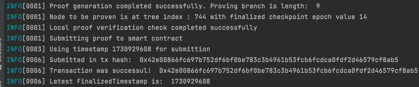

# BeaconState Checkpoint Proving Kit with EIP4788
[](./LICENSE)
[](https://github.com/mkenney/software-guides/blob/master/STABILITY-BADGES.md#experimental)
  [](https://techforpalestine.org/learn-more)


A Go application and smart contracts that can be used to generate and verify Merkle proofs for the BeaconState `finalized_checkpoint`. Eventually I would like to evolve it into a general purpose BeaconState Proving Kit.

## Introduction
Imagine if the EVM could introspect its own block finalization. Thanks to EIP4788, it can! Using this tool, you can at minimum prove timestamps that were finalized by consensus

This tool serves as an example for how to connect to an Ethereum Beacon Node, fetches a Beacon Block and its state for a specified slot, and generates a Merkle proof for the finalized checkpoint within that block. Then correctly prove it against a smart contract

I encourage you to fork this repository and adapt it to prove other pieces of BeaconState as necessary.

**THIS CODE IS NOT AUDITED AND SHOULD NOT BE USED IN PRODUCTION WITHOUT AUDITS**

## Installation
1. Clone the Repository:
```bash
git clone https://github.com/rzmahmood/beaconstate-proving-kit.git
cd beaconstate-proving-kit
```

2. Run unit tests against fixed data in `internal/checkpointproofs/testdata`
```bash
go test ./...
```

3. Build the Application:
```bash
go build -o proof-generator ./cmd/proof-generator
```

4. Run a Local PoS Network to e2e test against
See my local testnet setup which now supports EIP4788! https://github.com/rzmahmood/ethereum-pos-testnet . You will need to wait a few minutes until the first block is finalized. I normally see it by epoch 5 / block 160.
You can query the chain's finalized checkpoint via the following query which will eventually return a non-zero epoch: `curl http://127.0.0.1:4100/eth/v2/debug/beacon/states/head | jq .data.finalized_checkpoint`
Alternatively run a Sepolia Beacon Node as RPC providers do not serve Debug APIs which is required. A script I used with local reth/lighthouse binaries can be found [here](https://github.com/rzmahmood/ethereum-pos-testnet/blob/test-environment/sepolia.sh)


5. Deploy a verification smart contract to the network. For the local `ethereum-pos-testnet`, this can be done using the following.
```bash
cd smartcontracts
# Run the tests as a sanity check and to trigger build
forge test
# Private key is for an address premined with funds in the local testnet. This private key is well known. DO NOT USE IN PRODUCTION
export PRIVATE_KEY=0xac0974bec39a17e36ba4a6b4d238ff944bacb478cbed5efcae784d7bf4f2ff80
# RPC URL for Execution Client from local testnet
export RPC=http://localhost:8000
# Forge script to deploy the contract to local network. Logs will contain th deployment address
forge script script/DeployerFCT.s.sol:DeployFinalizedCheckpointTracker --fork-url $RPC --broadcast -vvvv
```

6. Run the checkpoint tracker proof generation and submission. Replace $CHECKPOINT_TRACKER_ADDRESS with the address from the forge script deployment. Use CLI help tools to replace defaults in fields if not using local testnet.
```bash
./proof-generator --checkpoint-tracker-address $CHECKPOINT_TRACKER_ADDRESS --slot 200
```

That's it! You've successfully proven to a smart contract that the timestamp was finalized. You should see logs as such as:



You can try running the same command again but it will fail since the epoch for the slot was already finalized (no need to prove the same thing twice!). You can try waiting for a new epoch to be finalized and retrying with a higher `slot` flag.

## Future Work and Limitations
- WARNING: This will only work on Deneb blocks.
- Key functionality has been tested, but not all cases I would like.
- This project does not consider forward compatability of Proof verification smart contracts, i.e. [EIP7688](https://ethereum-magicians.org/t/eip-7688-forward-compatible-consensus-data-structures/19673/7)
- This project is currently limited in that proving an epoch was finalized isn't particularly useful without also correlating it to a block number which is possible
- This project is not flexible to proving other parts of the BeaconState. However, it could be forked to do so with ease. Perhaps I will do this as a future project
  - Refactor to use Generalized Index 
- Currently I'm brute force searching the BeaconState Tree to find the index of the item I want. This is a limitation of the library I'm using

## Learnings and Hurdles
- Prysm Client for Beaconchain data is terrible. It removed the API Key from the path when querying, meaning I had to manually form paths. Eventually abandoned it.
- umbracle/go-eth-consensus ->  https://github.com/rzmahmood/go-eth-consensus
  - Hasn't been updated to support Deneb so I forked it and added Deneb Support by adding KZG commitments
  - I had to add Debug RPC support to the fork
- My local testnet was failing Beacon State root calculation due to an Epoch size of 6. Fixed it by changing Epoch size to 32


